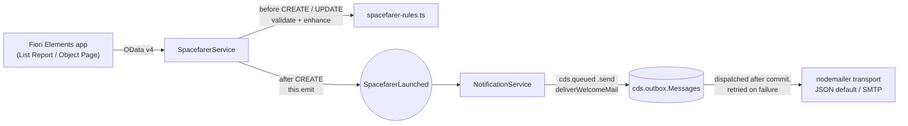
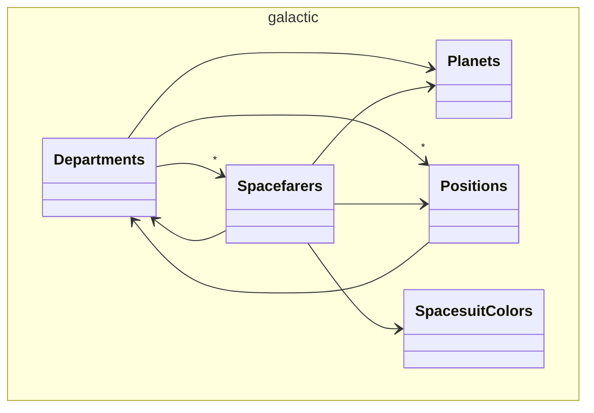

# Galactic Spacefarer Adventure

An SAP CAP (Node.js) service, written in TypeScript, and an SAP Fiori Elements V4 List Report /
Object Page app in JavaScript, for managing a roster of spacefarers across the SAP galaxy — a
take-home assessment for an SAP BTP full-stack role. The service validates and enhances every
new candidate (stardust collection, wormhole navigation skill, certification, call sign),
isolates the roster by origin planet, and sends a congratulation email through a transactional
queue once a candidate has launched.

`PLAN.md` and `PLAN-REVIEW-codex.md` document the design and an external review that shaped it.

## Task-to-code map

| Task | Requirement | Where |
|---|---|---|
| 1 | Data model (stardust, wormhole skill, planet, suit color, departments, positions) | `db/schema.cds`, `db/data/*.csv` |
| 2 | Protected CAP service with CRUD | `srv/spacefarer-service.cds`, `package.json` (`cds.requires.auth`), `xs-security.json` |
| 3 | `before CREATE` validate + enhance, `after CREATE` congratulation email | `srv/spacefarer-service.ts`, `srv/lib/spacefarer-rules.ts`, `srv/notification-service.cds`, `srv/notification-service.ts` |
| 4 | List Report: status + suit color, sort/filter/paging | `app/spacefarers/annotations.cds` (`UI.LineItem`, `UI.PresentationVariant`), `db/schema.cds` (calculated elements) |
| 5 | Object Page: editable stardust + suit color | `app/spacefarers/annotations.cds` (`UI.FieldGroup`s, `Common.FieldControl`) |
| Extra | SQLite locally | `@cap-js/sqlite` dev dependency, default `cds.requires.db` profile |
| Extra | Only authorized users | `@requires` on the service, `cds.requires.auth` mocked users, `xs-security.json` for production |
| Extra | Planet X must not see Planet Y data | `@restrict` on `Spacefarers` + `assertPlanetAllowed` in `srv/spacefarer-service.ts` |
| Extra | Hosted on GitHub | `.github/workflows/ci.yml` (CI gate for the repository) |

## Quick start

Prerequisites: Node.js >= 22 (tested with Node 24). No global `cds` install needed — `cds-dk`
is a local `devDependency` and all scripts call it through `npx`/`npm run`.

```bash
npm install
npm run generate-types   # cds-typer "*" -> writes @cds-models/ from the CDS model (gitignored)
npm run watch      # starts the CAP server with the mocked users below
```

`@cds-models/` is generated, not checked in; `npm run typecheck` and IDE type-checking need it,
so run `npm run generate-types` (or `npm run build`, which regenerates it as part of the
cds-typer build task) right after cloning.

Open `http://localhost:4004` — it lists the service and an app link (`/spacefarers/webapp/`),
or run `npm run watch-spacefarers` to open the app directly. The browser asks for basic auth;
**use a private window per user**, since browsers cache basic-auth credentials per origin.

| User | Password | Role | Planet |
|---|---|---|---|
| xavier | planetx | SpacefarerManager | X |
| yvonne | planety | SpacefarerManager | Y |
| vera | vera | SpacefarerViewer | X |
| zed | galaxy | GalacticAdmin | (all) |
| nobody | nobody | (none — 403) | — |

```bash
npm test         # vitest run                                -> 8 files, 87 tests
npm run lint      # cds lint                                  -> no findings (CDS model only; see Known limitations)
npm run typecheck # tsc --noEmit -p tsconfig.typecheck.json    -> no output
npm run build     # cds build --production -> gen/db (HANA), gen/srv (Node.js, compiled from TypeScript)
```

`test/http/spacefarers.http` has ready-to-run requests for a REST Client / IntelliJ
HTTP client, covering every scenario below.

```bash
cd app/spacefarers && npm ci        # karma, karma-ui5, @sap-ux/ui5-middleware-fe-mockserver
npm run test:ui                     # from the repo root: OPA5 journeys, headless, mock backend
```

See "UI tests (OPA5)" below for what this covers and how it's wired into CI.

## Architecture

Runtime flow from the Fiori app to the mailbox:



Domain model, from `npx cds compile db --to mermaid` (trimmed of the unused `sap.common`
code-list entities — Languages, Countries, Currencies, Timezones — that `CodeList`/`managed`
pull in automatically but nothing references):



## Data model and service

| Entity | Key | Notes |
|---|---|---|
| `Planets` | `code` | `CodeList`, `hazardLevel` 1–5, global reference data |
| `SpacesuitColors` | `code` | `CodeList`, `hex`, global reference data |
| `Departments` | `ID` (cuid) | `headquarters` → `Planets`; owns positions and spacefarers |
| `Positions` | `ID` (cuid) | `minWormholeSkill`, `department` → `Departments` |
| `Spacefarers` | `ID` (cuid) | draft-enabled, `managed`; the only planet-isolated entity |

Seed data: 6 planets, 8 suit colors, 6 departments, 12 positions, 60 spacefarers (24 on Planet X,
20 on Planet Y, 16 elsewhere) — enough to exceed the default page size and exercise
`@odata.nextLink`. Two elements are calculated on read, filterable and sortable server-side:

| `stardustCollection` | `stardustStatus` | `stardustCriticality` (`UI.CriticalityType`) |
|---|---|---|
| < 100 | Depleted | 1 (negative) |
| < 1,000 | Collecting | 2 (critical) |
| < 10,000 | Thriving | 3 (positive) |
| >= 10,000 | Legendary | 5 (information) |

Paging is server-driven: `@cds.query.limit: { default: 20, max: 100 }` on the service. Value
helps come from `@cds.odata.valuelist` on the four reference entities plus
`Common.ValueListWithFixedValues` on `originPlanet_code` / `spacesuitColor_code` in the UI
annotations, so Fiori renders them as dropdowns rather than dialogs.

## Security model

| Role | Grants | Planet-scoped |
|---|---|---|
| `SpacefarerViewer` | READ | yes — own planet only |
| `SpacefarerManager` | full CRUD + draft | yes — own planet only |
| `GalacticAdmin` | full CRUD | no — every planet |

`Spacefarers` carries:

```cds
@restrict: [
  { grant: 'READ', to: 'SpacefarerViewer',  where: (originPlanet.code = $user.planet) },
  { grant: '*',    to: 'SpacefarerManager', where: (originPlanet.code = $user.planet) },
  { grant: '*',    to: 'GalacticAdmin' }
]
```

The predicate uses the **association path** `originPlanet.code`, not the generated foreign key
`originPlanet_code` — the cds 10.1 compiler rejects the flat path here ("Element
`originPlanet_code` has not been found"; it only exists after OData processing generates it).
This filters READ/UPDATE/DELETE, but **CAP's Node.js runtime does not validate CREATE/UPDATE
input against a `@restrict where`** — nothing stops a Planet X manager from *creating* a row
that names Planet Y. `assertPlanetAllowed` in `srv/spacefarer-service.ts` closes that gap: it
runs on `NEW` (new drafts), `PATCH` (draft edits), `CREATE` and `UPDATE`, defaults the planet for
a user with exactly one, and rejects any planet outside the user's `attr.planet` list with 403
unless the user `is('GalacticAdmin')`.

Reference data (`Planets`, `SpacesuitColors`, `Departments`, `Positions`) is a shared galactic
catalog, readable by every role — only the spacefarer roster itself is planet-isolated, matching
the assessment's wording about spacefarer data rather than the catalogs.

Locally, `cds.requires.auth` uses `kind: 'mocked'` with the users table above; `attr: { planet:
[...] }` stands in for the XSUAA `planet` attribute, and an **empty attribute list means the
user is fully restricted** — `zed` (GalacticAdmin) has none and doesn't need one. In production,
`auth.kind = 'xsuaa'` and `db.kind = 'hana'` (`npx cds env requires.auth.kind --profile
production` confirms `xsuaa`). `xs-security.json` declares the three scopes, a `planet`
attribute (`valueRequired: false`), and role templates: `SpacefarerViewer`/`SpacefarerManager`
carry `"attribute-references": ["planet"]` so any role collection built from them must supply a
planet value; `GalacticAdmin` has none (galaxy-wide by design); a fourth template,
`userattributes`, carries the `planet` attribute for identities without an application scope. A
role collection missing the attribute value restricts that user to nothing, not to everything.

The three scope `description`s in `xs-security.json` are left exactly as `cds add xsuaa`/`cds
build` generate them (`"SpacefarerViewer"`, `"SpacefarerManager"`, `"GalacticAdmin"`) — cds
matches scopes by description, not by name, so a custom description there made `cds build`
append a duplicate scope entry on every rebuild instead of updating the existing one. The four
role-template `description`s and the `attribute-references` above are matched by name and survive
a rebuild, so those stay hand-written.

### Curl recipe (all five reproduced on this checkout)

```bash
curl -s -o /dev/null -w '%{http_code}\n' localhost:4004/odata/v4/spacefarers/Spacefarers
# 401 - anonymous
curl -s -o /dev/null -w '%{http_code}\n' -u nobody:nobody localhost:4004/odata/v4/spacefarers/Spacefarers
# 403 - authenticated, no galactic role
curl -s -u xavier:planetx 'localhost:4004/odata/v4/spacefarers/Spacefarers?$count=true' | jq '.["@odata.count"]'
# 24 - Manager on Planet X, sees only X rows
curl -s -u yvonne:planety 'localhost:4004/odata/v4/spacefarers/Spacefarers?$count=true' | jq '.["@odata.count"]'
# 20 - Manager on Planet Y
curl -s -u zed:galaxy 'localhost:4004/odata/v4/spacefarers/Spacefarers?$count=true' | jq '.["@odata.count"]'
# 60 - GalacticAdmin, all planets; a plain GET without $count returns 20 rows plus @odata.nextLink
```

## Task 3: validation, enhancement and the launch pipeline

`before CREATE` on `Spacefarers` (`srv/spacefarer-service.ts` + the pure functions in
`srv/lib/spacefarer-rules.ts`) runs after the declarative `@mandatory`/`@assert.*` checks and
validates: **email uniqueness** (`@assert.unique` only becomes a DB index; the pre-check turns a
would-be raw SQLite constraint error into a clean 400 on `email`), **position ⇄ department**
(a given position must belong to the given department; a missing department is derived from the
position via `completeAssignment`), the **minimum wormhole skill** for the position (checked
against the candidate's own skill, before any hazard bump), the **planet boundary**
(`assertPlanetAllowed`, shared with drafts and updates), and that a **planet is present** at all
(e.g. `zed` posting with no `originPlanet_code` gets 400, not a silent default).

Once validation passes, `enhanceCandidate` computes:

- `onboardingBonus = 100`, `+50` when the origin planet's `hazardLevel >= 4`.
- `stardustCollection += onboardingBonus`, capped at `MAX_STARDUST = 1,000,000`.
- `wormholeNavigationSkill += 1` on a hazardous planet, capped at `10`.
- `wormholeCertification`: Cadet (< 4), Navigator (< 8), Master (>= 8).
- `callSign`: `PLANET-INITIALS-HEX` (e.g. `X-AV-1A2B`).
- `launchedAt`: server timestamp.

`before UPDATE` re-reads the current row, merges the incoming change, and re-runs
`validateCandidate` against the **merged** row — so raising a spacefarer's position without
also raising their skill is still caught. It refreshes `wormholeCertification` when the skill
changes and rejects any attempt to change `originPlanet_code`, even for `GalacticAdmin`
(verified: a 400 attempt by `zed` leaves the row's planet unchanged).

`after CREATE` emits the declared `SpacefarerLaunched` event (`this.emit(...)`, a real part of
the service API, not just a declaration). `NotificationService` (`@protocol: 'none'`, no HTTP
endpoint of its own) subscribes once all services are served (`cds.on('served', ...)`) and
relays each launch into its **own** queue: `cds.queued(this).send('deliverWelcomeMail', {
briefing })`. That message is persisted in `cds.outbox.Messages` inside the same transaction as
the insert — a later failure rolls the whole thing back, a commit dispatches the mail
afterwards, and a transport error leaves the row queued with `attempts + 1` for retry. The queue
targets the *consumer* service, so the queue runner's dispatch is never blocked by
`SpacefarerService`'s own `@requires` check.

Mail transport (`srv/notification-service.ts`): nothing set (default) uses nodemailer's JSON
transport, which renders and logs the mail without sending it; `SMTP_URL`, or
`MAIL_TRANSPORT=smtp`, switches to real SMTP delivery (see `.env.example`). To see a mail: run
with the default transport, create a spacefarer, and watch the log for
`[notifications] - Cosmic welcome sent to <email> (<callSign>)` (always at `info`; the fully
rendered payload is at `debug`).

## Fiori Elements app

Generated headlessly with the SAP Fiori Application Generator 1.32.0 (`List Report Page V4`
template, UI5 1.152.0, service type "Local CAP", `servicePath: /odata/v4/spacefarers/`) before
any annotation was written by hand — the generator overwrites `annotations.cds`, so annotating
had to come second. `app/spacefarers/annotations.cds` then adds:

- **`UI.LineItem`**: name, origin planet, stardust collection, `stardustStatus` colored by
  `stardustCriticality`, spacesuit color, wormhole skill, department — via the generated scalar
  foreign-key properties (`originPlanet_code`, `department_ID`, ...), which render more reliably
  in Fiori Elements than association-valued fields.
- **`UI.SelectionFields`**: origin planet, spacesuit color, department, stardust status.
- **`UI.PresentationVariant`**: default sort by `stardustCollection` descending.
- **`UI.HeaderFacets`** with two `UI.DataPoint`s: `#Stardust` (colored by criticality) and
  `#Skill` (`Visualization: #Rating`, `TargetValue: 10` — a 10-star rating control).
- **`UI.FieldGroup`s** on the Object Page: Cosmic Identity, Cosmic Skills, Assignment, Launch Log.
- **`Common.Text` + `TextArrangement: #TextOnly`** on every association, and
  `Common.ValueListWithFixedValues` on planet and suit color, so both render as dropdowns backed
  by the code-list value helps.
- A **dynamic `Common.FieldControl`** on `originPlanet` instead of `@Core.Immutable`: read-only
  once the row is active, mandatory while still a new draft (`{ $If: [{ $Eq: [{ $Path:
  'HasActiveEntity' }, true] }, 1, 7] }`). `@Core.Immutable` was tried first and dropped — cds 10
  strips immutable fields from *every* draft PATCH, including the create dialog's own draft,
  which broke setting the planet on a brand-new spacefarer. The handlers are the real
  enforcement point either way; this is a UX nicety on top.
- `@readonly` model fields (`callSign`, `launchedAt`, `onboardingBonus`, `wormholeCertification`)
  render read-only automatically; `stardustCollection` and `spacesuitColor_code` (the two fields
  the assessment calls out) stay editable, along with skill, department, position and bio.

Run `npm run watch`, open `http://localhost:4004`, follow the app link, and sign in as any user
from the table above (private window per user, since basic auth is cached per origin). Sorting
and filtering are server-side `$orderby`/`$filter` requests; paging shows up as growing
`$skip`/`$top` requests capped by `@cds.query.limit`.

## Tests

```
Test Files  8 passed (8)
     Tests  87 passed (87)
```

(`npm test`, reproduced on this checkout; `npm run lint` and `npm run typecheck` both produced no
output, i.e. no findings.)

| File | Covers |
|---|---|
| `rules.test.ts` | Certification bands, call-sign formatting, `completeAssignment`, `validateCandidate`, `enhanceCandidate` (bonus, hazard bump, both caps, no-mutation) |
| `mail-content.test.ts` | Pure unit tests for `composeWelcomeMail`: subject, plain-text body fields, `to`/`from` addressing (default and override, undefined when the email is null or missing), HTML entity escaping in the `html` part (the raw `<script>` substring never reaches it) while the `text` part is deliberately left unescaped |
| `auth.test.ts` | 401 anonymous, 403 no-role; per-role counts (24/20/60); Planets visible to everyone; PATCH boundaries (viewer 403, own-planet 200, cross-planet 403/404) |
| `create.test.ts` | Full validation/enhancement matrix, direct active POST, cross-planet 403, missing-planet 400, admin create with hazard bonus, all 400 cases (range, duplicate email, below-minimum skill, position/department mismatch), calculated-element `$filter`/`$orderby`, paging, update re-validation, planet immutability, delete boundaries |
| `draft.test.ts` | New-draft defaults, PATCH, `draftActivate` running the CREATE handlers, cross-planet draft rejection, `draftEdit` on an existing row incl. cross-planet 403/404 |
| `notifications.test.ts` | Exactly one mail sent and outbox drained on success; nothing sent on a 400; a throwing transport leaves the message queued with `attempts >= 1` |
| `metadata.test.ts` | `$metadata` shape: draft `IsActiveEntity` key, `Common.ValueList` on the three FK properties, `Core.Computed` on `callSign`, `Capabilities.InsertRestrictions` on `Planets` |
| `messages.test.ts` | All six service error-message `_i18n` keys actually resolve, over real HTTP with interpolation, from the text bundle; a seventh test that `$metadata` serves resolved model-label text and contains no raw `{i18n>` key at all — guards against CAP passing an unresolvable key through as the literal user-facing message, which a renamed key or an unpackaged bundle would otherwise leave green |
| `helpers.ts` | Shared request-option constants (`asXavier`, ...), the `throwing` validateStatus option, and the `ODataCollection`/`ODataError`/`SpacefarerRow` types plus boundary-cast helpers used by the files above — no tests of its own |

CI (`.github/workflows/ci.yml`) runs on Node 24, on every push to `main` and every pull
request, as two separate jobs so a UI failure and a service failure are distinguishable:
`verify` — `npm ci`, `npm run generate-types` (writes `@cds-models/`, which is gitignored),
`npm run lint`, `npm run typecheck`, `npm test`, `npm run build` — and `ui-opa5`, the OPA5
journeys described under "UI tests (OPA5)" below.

## Deployment to SAP BTP (build-verified only, not deployed)

`mta.yaml` declares three modules and two resources:

| Module | Type | Path | Role |
|---|---|---|---|
| `galactic-spacefarer-adventure-srv` | `nodejs` | `gen/srv` | the CAP service |
| `galactic-spacefarer-adventure-db-deployer` | `hdb` | `gen/db` | HDI deployer for the HANA artifacts |
| `galactic-spacefarer-adventure` | `approuter.nodejs` | `.deploy/app-router` | standalone approuter |

| Resource | Service |
|---|---|
| `galactic-spacefarer-adventure-auth` | `xsuaa`, `xs-security.json`, four role collections (Viewer/Manager/Admin/`userattributes`) |
| `galactic-spacefarer-adventure-db` | `hana`, `hdi-shared` |

`.deploy/app-router/xs-app.json` has a single catch-all route forwarding everything to the
`srv-api` destination with `csrfProtection: true`. Build and package (not executed here):

```bash
npm run build        # cds build --production -> gen/db, gen/srv
npm i -g mbt
mbt build             # -> mta_archives/*.mtar
cf deploy mta_archives/*.mtar
```

Whoever assigns the BTP role collections must set the `planet` attribute value(s) on the
Viewer/Manager role collection assignments — an assignment with the attribute left empty
restricts that user to nothing, per the XSUAA note above.

**What was not done, deliberately:** there is no HTML5 module in `mta.yaml`, and
`cds build --production` does not copy `app/` into `gen/srv` (confirmed on this build — `gen/srv`
has only `csn.json`, `srv/`, `_i18n`, no `webapp` folder). The Fiori app is therefore not deployed
by this descriptor: the approuter proxies OData calls but has nothing to serve for the UI.
Wiring it in would mean either `cds add html5-repo` (HTML5 Application Repository + managed
approuter + matching `mta.yaml`/`xs-app.json` routes) or serving `app/` from the CAP server in
production. Also, `test/http/spacefarers.http` is hand-written rather than generated, because
`cds add http` fails in `cds-dk` 10.1.1 with an internal `TypeError`.

## Design decisions and trade-offs

- **`@restrict where` uses the association path**, not the generated foreign key — the only form
  the cds 10.1 compiler accepts at this point in the pipeline.
- **A handler enforces the planet boundary on write**, because CAP's Node.js runtime does not
  validate CREATE/UPDATE input against `@restrict where`.
- **No `@Core.Immutable`** on the origin planet — cds 10 strips immutable fields from every draft
  PATCH, including a brand-new draft's own create dialog. The boundary lives in the handlers; the
  dynamic `FieldControl` just reflects it in the UI.
- **Reference data is a shared galactic catalog** — only the spacefarer roster is planet
  isolated, which is what "must not see Planet Y data" means for spacefarers specifically.
- **The notification queue targets the consumer**, not the emitting `SpacefarerService`, so a
  role check on the producer can never block mail dispatch.
- **JSON transport by default, SMTP as the only alternative** — an Ethereal throwaway-inbox
  transport was considered and dropped; one injectable transport plus the transactional queue
  showcases reliable delivery without a third-party account.
- **Three roles instead of two.** `SpacefarerViewer` costs one extra role template and two extra
  tests; kept as a deliberate least-privilege showcase.
- **No custom bound action.** An earlier `awardStardust` action was cut: it bypassed the same
  validation path and added authorization/draft/range-testing surface for no real requirement.
- **Node's native type stripping, not a loader.** `srv` and `test` run as plain Node ESM/TS:
  relative imports carry an explicit `.ts` extension (e.g. `./lib/spacefarer-rules.ts`), enabled
  by `allowImportingTsExtensions` + `rewriteRelativeImportExtensions` in `tsconfig.json`, so `tsc`
  rewrites those specifiers to `.js` on emit while plain Node strips the types and runs the
  source as-is. Running the suite through the `tsx` loader instead measured 37.7s versus 5.0s for
  native stripping. `erasableSyntaxOnly` is on so nothing non-strippable (e.g. enums, parameter
  properties) creeps in.
- **`tsc` is the real gate, and it is wired into the build.** `cds build` runs the compiler
  through the cds-typer build task and fails the build on type errors, so `npm run build`
  double-checks what `npm run typecheck` already reports. `tsconfig.json` deliberately includes
  only `srv` and `@cds-models` — otherwise `cds build` would compile the tests into `gen/srv` —
  and `tsconfig.typecheck.json` extends it, widening `include` to `test` for local/CI checking.
- **The `@sap/cds` path mapping has to point at the declaration file itself**,
  `./node_modules/@cap-js/cds-types/dist/cds-types.d.ts` — `tsconfig.json` now carries a `"//"`
  comment recording this, since the reason isn't visible from the mapping alone. The mapping `cds
  add typescript` generates points at the package directory instead, which does not resolve under
  `moduleResolution: NodeNext` (the package exposes only a `typings` field, not `exports`), and
  the resulting `TS7016` cascades into "Property 'before' does not exist" on every service class.
  Not something a version bump fixes, either: `@cap-js/cds-types` 0.19 still ships no
  `types`/`exports` field (0.18.0 is what's installed here). The same comment records why
  `include` stays narrow — `cds build` compiles whatever `tsconfig.json` includes into `gen/srv`.
- **Tests must set `CDS_TYPESCRIPT`, and now fail loudly if it isn't.** `vitest.config.ts` sets
  `env: { CDS_TYPESCRIPT: 'true' }`; cds only looks for `.ts` service implementations when that
  variable is set (the `cds` CLI sets it itself when it finds a `tsconfig.json`, but tests boot
  the server in-process and bypass the CLI). Without it, the server used to start anyway and serve
  the entities with no custom handlers — tests then failed on puzzling status codes rather than a
  load error. `test/helpers.ts`, imported by all six server test files, now throws a clear error
  the moment the variable is missing, so that silent failure mode can't recur unnoticed.
- **`srv/lib/cds.ts` requires the `@sap/cds` singleton synchronously, instead of a static ESM
  import.** `@sap/cds` is CommonJS, and `cds serve` imports the two service modules concurrently;
  a plain `import cds from '@sap/cds'` in either one can bind to an empty object that **never**
  fills in — it is not a live binding that resolves later — so `class X extends
  cds.ApplicationService` throws `Class extends value undefined` at module evaluation, and
  deferring every access into `init()` still fails later with `cds.log is not a function`.
  `createRequire(import.meta.url)('@sap/cds')` always yields the finished singleton, so both
  service files start with `import { cds, type CDS } from './lib/cds.ts'` and use `cds.*` at
  runtime, `CDS.Request` / `CDS.User` in type positions — the explanation lives once, in that
  module, instead of as a per-file preamble. Verified: 6 of 6 clean starts with it, 5 of 5
  failures without. The same race is why **`#cds-models` is imported for types only**: the
  generated `@cds-models/_/index.js` itself does `import cds from '@sap/cds'`, so a value import
  of a generated entity proxy would drag the broken ESM import straight back in, while a
  type-only import is erased and costs nothing (confirmed by instrumenting the generated module —
  it is never loaded at runtime). Entities still come from `this.entities` /
  `cds.entities('galactic')`; `#cds-models/*` only supplies `import type` positions.
- **No `prepare` script for type generation.** `cds build` copies the project's `scripts` into
  `gen/srv/package.json`, where a `prepare` hook would run again during the production `npm ci` —
  `generate-types` and `typecheck` are invoked explicitly (in CI, and by `npm run build` via the
  cds-typer build task) instead.

## UI tests (OPA5)

`app/spacefarers/webapp/test/integration/` ships two Fiori-tools-generated OPA5 journeys
(list report load + navigate to object page) that, as generated, could not run at all: no
`test/flp.html`, no QUnit entry point, and nothing in CI ever invoked them. They now run
headlessly, against a mock OData backend rather than the real CAP server:

- `webapp/localService/metadata.xml` — the service's real `$metadata`, captured once from a
  running `cds-serve` (`curl -u xavier:planetx .../odata/v4/spacefarers/$metadata`) and
  committed, so the mock server's generated data always matches the current model shape.
- `app/spacefarers/ui5-mock.yaml` — the same `fiori-tools-proxy` (UI5 framework resources
  from the SAPUI5 CDN) and `fiori-tools-preview` (the FLP sandbox at `/test/flp.html`,
  generated on the fly — no physical file needed) middleware as `ui5.yaml`, plus
  `@sap-ux/ui5-middleware-fe-mockserver` in front of `/odata/v4/spacefarers/`, with
  `generateMockData: true` so no hand-maintained mock JSON is needed.
  `builder.resources.excludes` (shared with `ui5.yaml`) keeps `/test/**` and
  `/localService/**` out of any production build.
- `app/spacefarers/karma.conf.js` runs `webapp/test/integration/opaTests.qunit.html`
  through `karma-ui5` in `ChromeHeadless`. `opaTests.qunit.js` collects both journeys and
  calls `JourneyRunner.run([...])` **once** — the generated `*.gen.js` files each used to
  call `runner.run([journey])` on the same shared runner, which works for exactly one file
  but registers OPA5's page objects a second time (a logged, non-fatal "namespace clash")
  the moment a second generated journey is added.
- **Backend choice: mock server, not the real CAP service.** Both were evaluated. The real
  server needs a browser to authenticate against `cds.requires.auth`, and this project's
  `[production]` profile is `xsuaa`-only (see the Security model section) — reusing the
  mocked dev profile for a browser session would mean either HTTP Basic Auth (a native
  browser dialog karma-ui5's headless iframe can't drive) or a relaxed test-only auth
  profile, more moving parts for no gain here. The mock server needs no backend at all,
  no auth handshake, and is the more common setup for Fiori Elements OPA5 journeys in CI.

Run it locally: `npm run test:ui` (root) or `npm run test:opa` (from `app/spacefarers`); the
latter needs `npm ci` there first (see Quick start below). The app keeps its own committed
lockfile so that install — and the CI job's — is reproducible. `npm run start:mock` (from
`app/spacefarers`) previews the app against the same mock server in a real browser.

**Known flakiness, and why it's still wired into CI:** locally, this sandbox's network path
to the SAPUI5 CDN (used for `/resources` and `/test-resources`, since a cold headless Chrome
profile has no HTTP cache) measured highly variable — single-file fetches of the same
`sap-ui-core.js` ranged from 0.8s to 10.6s across five consecutive `curl` calls with nothing
else running, with occasional `ECONNRESET`s and full stalls. Across 8 local runs while
building this out, 4 passed cleanly (all 5 opaTests green) and 4 failed on an OPA5 step
timeout or a browser disconnect — a measured, reproducible ~50% local failure rate, not a
test-logic bug (every failure was a timeout/network error, never a wrong assertion). There is
no way to remove the SAPUI5 CDN dependency here: `sap.fe.templates` and `sap.ushell` are not
published to the public npm registry (unlike plain `sap.m`/`sap.ui.core`, under
`@openui5/*`), so there's no offline/local-framework fallback available to this project.
GitHub Actions runners get dedicated, well-provisioned network egress that this shared local
sandbox does not, so the `ui-opa5` CI job's actual reliability was verified there directly
(see the PR this shipped in) rather than assumed from local runs alone.

## Known limitations / next steps

- **The Fiori app is not part of the BTP deployment yet** — see the deployment section above.
- **The dev queue lives in the in-memory SQLite database** and is lost on a restart; a persistent
  SQLite profile or the production HANA profile would survive restarts.
- **ESLint does not cover the TypeScript sources.** `typescript-eslint` 8.70 supports TypeScript
  `>=4.8.4 <6.1.0`, and there is no release yet supporting TypeScript 7, so `eslint.config.mjs`
  has no rule set for `.ts` files at all — `npx eslint 'srv/**/*.ts'` reports every match ignored,
  not clean. `npm run lint` (`cds lint`) therefore only covers the CDS model; `npm run typecheck`
  and `npm run build` are what actually gate the TypeScript sources.

## Repository layout

```
.
├── @cds-models/                 generated by cds-typer (`npm run generate-types`); gitignored
├── .deploy/app-router/          standalone approuter (xs-app.json, package.json, default-env.json)
├── .env.example                 SMTP_URL / MAIL_TRANSPORT switches
├── .github/workflows/ci.yml     verify (npm ci/lint/typecheck/test/build) + ui-opa5, on Node 24
├── app/
│   ├── services.cds             pulls app/spacefarers/annotations.cds into the served model
│   └── spacefarers/             generated Fiori Elements V4 app (List Report + Object Page)
│       ├── annotations.cds      hand-written UI annotations
│       ├── ui5.yaml              fiori-tools-proxy to http://localhost:4004
│       ├── ui5-mock.yaml          test-only: + sap-fe-mockserver, no CAP server needed
│       ├── karma.conf.js          karma-ui5 + ChromeHeadless, see "UI tests (OPA5)"
│       └── webapp/               manifest.json, Component.js, index.html, i18n
│           ├── localService/metadata.xml  captured $metadata, feeds the mock server
│           └── test/integration/          the two OPA5 journeys + opaTests.qunit.html/js
├── db/
│   ├── schema.cds                domain model, namespace galactic
│   └── data/                     Planets(6) SpacesuitColors(8) Departments(6) Positions(12) Spacefarers(60)
├── srv/
│   ├── spacefarer-service.cds    SpacefarerService: draft-enabled Spacefarers, code lists, event
│   ├── spacefarer-service.ts     NEW/CREATE/UPDATE handlers, planet boundary, event emit
│   ├── notification-service.cds  internal NotificationService (@protocol: 'none')
│   ├── notification-service.ts   nodemailer transport selection + mail template
│   └── lib/
│       ├── cds.ts                 loads the @sap/cds singleton synchronously (see design decisions)
│       └── spacefarer-rules.ts    pure validation/enhancement functions (unit-tested)
├── test/
│   ├── *.test.ts                 auth, create, draft, mail-content, messages, metadata, notifications, rules
│   ├── helpers.ts                shared request options, OData response types, boundary casts
│   └── http/spacefarers.http     manual REST Client requests
├── xs-security.json              XSUAA scopes, role templates, planet attribute
├── mta.yaml                      srv + db-deployer + approuter modules, xsuaa + hana resources
├── package.json                  ESM, scripts, mocked users, mail config
├── tsconfig.json, tsconfig.typecheck.json    compiler options for the build / for local+CI checking
├── vitest.config.ts, eslint.config.mjs
├── PLAN.md, PLAN-REVIEW-codex.md design notes and an external review
└── README.md                     this file
```
